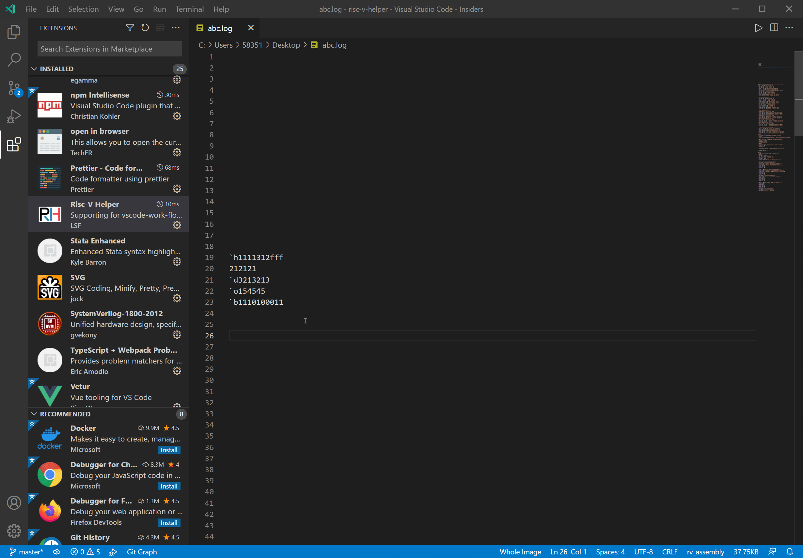

# Risc-V Helper

强化vscode用于开发RISC-V的work-flow

## Features

以下特性有效范围：xxx.log文件

- ### 1.1 数制转换[2021-8-1]

- ### 1.2 Risc-V Vector汇编高亮

  - Vector Loads and Stores [2021-8-1]
  - ~~Vector Arithmetic ~~Instructions~~ [developing]

## Using

### 1.1 数制转换

### 1.2 Risc-V Vector汇编高亮

#### 1.2.1 Vector Loads and Stores [2021-8-1]

